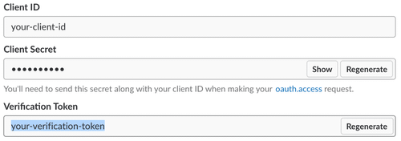
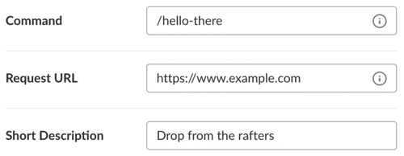
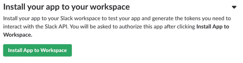
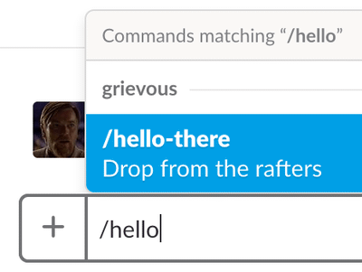

# Going “Serverless”

Now that we know how to write functions with python, and have built a few programs that we can run locally from the command line, it’s time to take the leap “into the cloud”.

Essentially all this means is that instead of running a function on our laptop we’re going to tell Amazon Web Services (AWS) Lambda to run the function on one of their servers whenever someone makes a web/http request to a particular address. (derived from [https://github.com/aws/chalice](https://github.com/aws/chalice) readme)


### Setup

To start, you'll use the chalice command line utility to create and deploy a hello-world function. We’ll do this inside a “virtualenv”, which is just a way of collecting all the python modules your code uses together with your code. Using a virtualenv is a good idea when you’re writing a program to run on someone else’s computer because you don’t have to worry about whether they have the same versions of those modules as you. The following lines will install the virtualenv tool, create a virtualenv in the directory “aws-hello-world” and “activate” it, which means that pip and python commands we run after this will install/use modules in the aws-hello-world virualenv:


```
$ pip3 install virtualenv
$ cd workspace/codeclass
$ virtualenv aws-hello-world
$ source aws-hello-world/bin/activate
```


You can use the ‘which’ command to verify that you’re now using the python installed in the virtualenv rather than the system version:


```
$ which python
/Users/mjeffryes/workspace/codeclass/aws-hello-world/bin/python
$ python -V
Python 3.7.3 (v3.7.3:ef4ec6ed12, Mar 25 2019, 16:52:21)
```


You can get out of the virtualenv by closing your terminal window and opening a new one. To get back in, just run the activate script again:


```
$ source ~/workspace/codeclass/aws-hello-world/bin/activate
```


Next, in your virtualenv, install chalice:


```
$ pip install chalice
```


You can verify you have chalice installed by running:


```
$ chalice --help
Usage: chalice [OPTIONS] COMMAND [ARGS]...
...
```


### Credentials

Before you can deploy a function to AWS Lambda, we have to create an AWS account and give chalice access to it. If you do not have an AWS account create one here: [https://portal.aws.amazon.com/billing/signup#/start](https://portal.aws.amazon.com/billing/signup#/start).

Next,create a new user: go to your AWS account, then go to Services and select IAM. Then choose Users and click on “Add User”. (direct link: [https://console.aws.amazon.com/iam/home#/users$new?step=details](https://console.aws.amazon.com/iam/home#/users$new?step=details)) Give the user a name, and check the “Programmatic Access” button. Give it the [AWSLambdaFullAccess](https://console.aws.amazon.com/iam/home#/policies/arn%3Aaws%3Aiam%3A%3Aaws%3Apolicy%2FAWSLambdaFullAccess), [IAMFullAccess](https://console.aws.amazon.com/iam/home#/policies/arn%3Aaws%3Aiam%3A%3Aaws%3Apolicy%2FIAMFullAccess)  and [AmazonAPIGatewayAdministrator](https://console.aws.amazon.com/iam/home#/policies/arn%3Aaws%3Aiam%3A%3Aaws%3Apolicy%2FAmazonAPIGatewayAdministrator) policies. Skip the tags and finish creating the user. You should get to a page that shows the new user’s Access Key ID and Secret Access Key. Save these in a configuration file in your home directory:


```
$ mkdir ~/.aws
$ cat >> ~/.aws/config <<EOF
[default]
aws_access_key_id=YOUR_ACCESS_KEY_HERE
aws_secret_access_key=YOUR_SECRET_ACCESS_KEY
region=us-west-2
EOF
```


If you want more information on all the supported methods for configuring credentials, see the [boto3 docs](http://boto3.readthedocs.io/en/latest/guide/configuration.html).


### Creating Your Project

The next thing we'll do is use the `chalice` command to create a new project:


```
$ cd aws-hello-world
$ chalice new-project helloworld
```


This will create a `helloworld` directory. Cd into this directory. You'll see several files have been created for you:


```
$ cd helloworld
$ ls -la
drwxr-xr-x   .chalice
-rw-r--r--   app.py
-rw-r--r--   requirements.txt
```


You can ignore the `.chalice` directory for now, the two main files we'll focus on is `app.py` and `requirements.txt`.

Let's take a look at the `app.py` file:


```
from chalice import Chalice

app = Chalice(app_name='helloworld')

@app.route('/')
def index():
    return {'hello': 'world'}
```


The `new-project` command created a sample app that defines a single view, `/`, that when called will return the JSON body `{"hello": "world"}`.


### Deploying

Let's deploy this app. Make sure you're in the `helloworld` directory and run `chalice deploy`:


```
$ chalice deploy
Creating deployment package.
Updating policy for IAM role: hello-world-dev
Updating lambda function: hello-world-dev
Creating Rest API
Resources deployed:
  - Lambda ARN: arn:aws:lambda:us-west-2:360754837766:function:hello-world-dev
  - Rest API URL: https://by5fyhnk27.execute-api.us-west-2.amazonaws.com/api/
```


You now have an API up and running using API Gateway and Lambda:


```
$ curl  https://by5fyhnk27.execute-api.us-west-2.amazonaws.com/api/
{"hello": "world"}
```

(You can also visit that link from a web browser.) Try changing the string returned by the `index` function in `app.py` and redeploying to see your changes. (You can redeploy by just running `chalice deploy` again.)


### Slacking Off

Returning a response to a browser is so 2015, all the cool kids are building slack apps these days. With just a few more steps, we can turn our function into a slack bot and win fame and glory around the office. (derived from [https://renzo.lucioni.xyz/serverless-slash-commands-with-python/](https://renzo.lucioni.xyz/serverless-slash-commands-with-python/))


#### Setup

Custom slash commands require a [Slack app](https://api.slack.com/slack-apps). To get started, go [here](https://api.slack.com/slack-apps) to create one. Once you’ve created it, scroll down to the “App Credentials” section and make a note of your app’s verification token, shown highlighted below. You’ll need it later.




You’re going to create a command invoked with /hello-there-<yourname> which responds with [“General Kenobi!”](https://youtu.be/frszEJb0aOo) whenever the command is run. Navigate to the “Slash Commands” section and click “Create New Command.” Fill in the information shown below and save the form.




The Request URL you’re providing here is a placeholder. You’ll come back and update it soon. For now, the last step is to install the app in your Slack workspace. Go back to your app’s “Basic Information” page, click “Install App to Workspace,” and authorize the app.




You should now be able to open Slack and see your slash command autocomplete as you type /hello.



Sadly, your command doesn’t respond the way you want it to yet. Let’s change that.


#### Development

Return to the hello-world chalice app you created above and edit app.py to add a new function/route


```
@app.route('/hello-there',
  methods = ['POST'],
  content_types=['application/x-www-form-urlencoded'])
def hello_there():
   # You can access the text the user typed after the command too:
   #from urllib.parse import parse_qs
   #params = parse_qs(app.current_request.raw_body.decode())
   #user_text = params['text']
   return {
      'response_type': 'in_channel',
      'text': '<https://youtu.be/frszEJb0aOo|General Kenobi!>'
   }
```


Save your changes, run chalice deploy, and update the request url in your slash command to the url returned by chalice. Hope into slack and try it out!

What else can you build? A dice rolling command? rock-paper-scissors?
