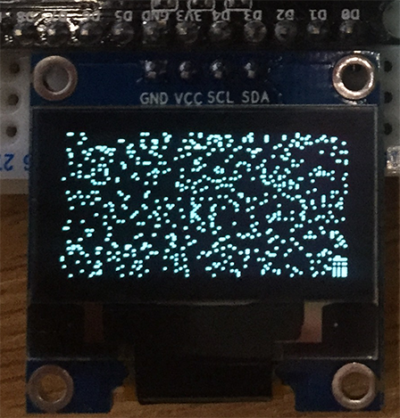

# Playing with microcontrollers using micropython

It used to be that you had to learn a “low-level” language like C in order to be able to program the microcontrollers used to control small electronic devices, but recently microcontrollers with the power to run python have gotten cheap enough and small enough to be a viable option for “embedded programming”. The Micropython project is dedicated to making python run on popular microcontrollers. We’ll be using it on an ESP8266 chip, on a development board known as the “NodeMCU” (This board was actually designed by the NodeMCU project to run Lua, another higher level language, but it’s proven to be a popular enough design that it’s copied and used for all sorts of projects.)


# Trying out MicroPython

(This section assumes your board is already setup with micropython; When working with a new board, follow the setup guide below)


*   Use a micro usb cable to connect the board to your computer
*   `$ ls /dev/tty.* `should show something like` /dev/tty.SLAB_USBtoUART`
*   If not, download and install the the serial over USB driver: [https://www.silabs.com/products/development-tools/software/usb-to-uart-bridge-vcp-drivers](https://www.silabs.com/products/development-tools/software/usb-to-uart-bridge-vcp-drivers)
*   `$ screen /dev/tty.SLAB_USBtoUART 115200 # Use the tty you found`
*   Hit enter a few times, you should the `>>>` of a python command prompt!
*   Time to try a few python commands:
    *   Print something:

            ```
            >>> print('hello esp8266!')
            hello esp8266!
            ```


    *   Do some math:

            ```
            >>> 2 + 2
            4
            ```


    *   Blink an LED

            ```
            >>> import machine
            >>> pin = machine.Pin(2, machine.Pin.OUT)
            >>> pin.on()
            >>> pin.off()
            ```


    *   Make a function to blink the light a certain number of times:

            ```
            >>> def blink(n):
            ...     if n > 0:
            ...         pin.off()
            ...         time.sleep(1)
            ...         pin.on()
            ...         time.sleep(1)
            ...         blink(n-1)
            ...
            ...
            ...
            >>> blink(5)
            >>>
            ```


*   Walk through sections 3-5 on the micropython tutorial (filesystem, & network): [https://docs.micropython.org/en/latest/esp8266/tutorial/filesystem.html](https://docs.micropython.org/en/latest/esp8266/tutorial/filesystem.html)


## WebREPL

Note: we had trouble with webrepl in class, (possibly too much wifi contention in the room), https://github.com/dhylands/rshell is a possible alternative.

Entering commands on the repl is starting to get tedious; Fortunately, micropython also provides a tooling for accessing the repl and transferring files via the wifi interface.


*   `>>> import webrepl_setup`
*   Follow the instructions to enable the webrepl. Use password “nsacode” and reboot when it asks.
*   After reboot, you may need to reconnect screen. Type ctrl-a, ctrl-\ to exit screen (say yes when it asks if you want to kill all windows). Rerun your last screen command.
*   Visit [http://micropython.org/webrepl](http://micropython.org/webrepl) on your laptop.

In theory, you should be able to enter the ip address of your board on the page and connect now (assuming it is connected to the same wifi network), but I haven’t been able to get that to work, so we’re going to connect to the device as if it is an access point.


*   On the device:

        ```
        >>> import network
        >>> ap_if = network.WLAN(network.AP_IF) # create access-point interface
        >>> ap_if.active(True) # enable access-point interface
        >>> ap_if.config(essid='<something>') # choose a unique name for your wifi
        ```


*   Now connect your laptop to the wireless network you just created. The password will be “micropythoN”.
*   Returning to the webrepl page, click connect. You should be able to use the repl in the web page to issue commands to your device now.
*   You can also transfer files to the device from this page. Let’s create a `util.py` file with some helpful commands we’ve seen so far:

        ```
        import network

        sta_if = network.WLAN(network.STA_IF)
        ap_if = network.WLAN(network.AP_IF)

        import sys

        def cat(filename):
          with open(filename) as f:
            for line in f:
              sys.stdout.write(line)

        import os

        def ls():
          return os.listdir()
        ```


*   Copy util.py to your device. And load it with: `>>> from util import *`
*   Try out some of the functions!


## Display

Our device would be a lot more fun with a display. Let’s set one up:


*   Unplug from usb to remove power
*   Carefully connect the display lining up the ground and vcc pins as shown in the picture:



*   Plug in usb, reconnect screen
*   Turn it on:
    *   >>> from machine import *
    *   >>> iic = I2C(scl = Pin(2), sda = Pin(0))
    *   >>> iic.writeto(60, b'\x80\xAF')
    *   >>> iic.writeto(60, b'\x80\x8D\x80\x14')
*   Fortunately for us, there are now drivers available for this display chip so we don’t have to write commands directly to the I2C interface.
    *   >>> import ssd1306
    *   >>> oled = ssd1306.SSD1306_I2C(128, 64, iic)
    *   >>> oled.text('Hello', 20, 10)
    *   >>> oled.text('World!', 30, 20)
    *   >>> oled.show()


## Starwars

Now that we have all the pieces, let’s see if we can display starwars on our display just like we saw in the code reading. First, let’s create a ‘telnet.py’ with utilities for connecting to the server and streaming the bytes into a sink:


```
    import socket

    # urllib is not implemented yet so write our own:
    def urlopen(url, port):
      addr_info = socket.getaddrinfo(url, port)
      addr = addr_info[0][-1]
      try:
        s = socket.socket()
        s.connect(addr)
        return s
      except:
        s.close()

    import time
    import errno

    def streamer(sink, url, port):
      s = urlopen(url, port)
      try:
        # Set blocking = false to allow us to just get the data that's arrived
        # without worrying too much about how much is there
        s.setblocking(False)
        while True:
          try:
            data = s.recv(100)
            sink(data)
          except OSError as e:
            if e.args[0] == errno.EAGAIN:
              # if there's no data yet, sleep for a bit
              time.sleep_ms(100)
              continue
            else:
              raise e
      finally:
        s.close()

    terminal_sink = lambda d: print(str(d, 'utf8'), end= '')

    def starwars(sink = terminal_sink):
      streamer(sink, "towel.blinkenlights.nl", 23)
```


Load this file onto your device and play with the functions until you are comfortable with how they work. Next, let’s create a ‘display.py’ with some of the character to pixel logic borrowed from the code we read:


```
    from machine import I2C, Pin
    import ssd1306

    iic = I2C(scl = Pin(2), sda = Pin(0))
    oled = ssd1306.SSD1306_I2C(128, 64, iic)

    # we need to know the numeric ordinal of several characters.
    # Doing this outside the loop is probably better than inside
    SPACE = ord(' ')
    CR = ord('\r')

    row = 0
    col = 0
    skip = 0

    def oledsink(data):
      global row
      global col
      global skip
      for byte in data:
        if skip:
          skip -= 1
          continue
        # 0x1b = escape byte, we assume this means to clear the screen
        if byte == 0x1b:
            skip = 2
            oled.show()
            oled.fill(0)
            row = 0
            column = 0
        elif byte == CR: # CR indicates newline
            skip = 1
            row += 1
            col = 0
        elif byte == SPACE:
            col += 1
        else:
            screencol = (col-4)*2 # Map a character col to screen pixel
            if screencol >= 0 and screencol < 127: # Ignore pixels that are off-screen
              oled.rect(screencol, row*4, 2, 4, 1)
            col += 1
```


Experiment with it a bit to see how it works:

`>>> from display import *`


```
>>> oledsink('     Hello world! This is fun'.encode('utf8'))
>>> oledsink([0x1b])
```


Now lets glue it together. Put the following into ‘main.py’:


```
    from display import *
    from telnet import starwars

    starwars(oledsink)
```


Load it onto the device and press reset to watch the show!


## Next Steps

We’ve only scratched the surface of what we could do. Here are a couple ideas for other things you could try:


*   Our starwars is kind of blocky because we just draw a rectangle for every character. Can you improve the quality. (You might start with the CHARS from the code reading.)
*   I brought a little pulse sensor. Can you read the value from the sensor and display it on the screen? ([https://www.twobitarcade.net/article/wemos-heart-rate-sensor-display-micropython/](https://www.twobitarcade.net/article/wemos-heart-rate-sensor-display-micropython/) and [https://docs.micropython.org/en/latest/esp8266/quickref.html#adc-analog-to-digital-conversion](https://docs.micropython.org/en/latest/esp8266/quickref.html#adc-analog-to-digital-conversion) may be useful)
*   Could you load other ASCII images on to the screen? Or make an interesting screensaver?


# Setup Guide (For Reference)


## Parts


*   [ESP8266 NodeMcu](https://www.amazon.com/gp/product/B07L8W9SP3/ref=ppx_yo_dt_b_asin_title_o02_s00?ie=UTF8&psc=1)
*   [Breadboard](https://www.amazon.com/gp/product/B07LFD4LT6/ref=ppx_od_dt_b_asin_title_s00?ie=UTF8&psc=1)
*   [OLED display](https://www.amazon.com/gp/product/B07F3KY8NF/ref=ppx_yo_dt_b_asin_title_o00_s00?ie=UTF8&psc=1)
*   [Pulse Sensor](https://www.amazon.com/gp/product/B01CPP4QM0/ref=ppx_yo_dt_b_asin_title_o01_s00?ie=UTF8&psc=1)


## Useful Docs


*   [Pinout](https://cdn.instructables.com/FJC/J4AP/JH8JBTHA/FJCJ4APJH8JBTHA.LARGE.jpg)
*   [Micropython for ESP8266 reference ](https://docs.micropython.org/en/latest/esp8266/quickref.html)


## Connecting to the board


*   Carefully remove the board from packaging and plug it into the breadboard.
*   Plug in the micro USB cable to the board. Plug the other end into your computer.
*   Open System Information you should see a “CP2102 USB to UART Bridge Controller” connected somewhere to USB.
*   Download and install the the serial over USB driver: [https://www.silabs.com/products/development-tools/software/usb-to-uart-bridge-vcp-drivers](https://www.silabs.com/products/development-tools/software/usb-to-uart-bridge-vcp-drivers)
*   `$ ls /dev/tty.* `should show something like` /dev/tty.SLAB_USBtoUART`
*   `$ screen /dev/tty.SLAB_USBtoUART 921600 # Use the tty you found`
*   Press reset button on the device. You should see something like:` `

        ```
        �����=��4����

        NodeMCU custom build by frightanic.com
                branch: master
                commit: c8037568571edb5c568c2f8231e4f8ce0683b883
                SSL: false
                modules: cjson,file,gpio,net,node,pwm,tmr,uart,wifi
         build  built on: 2016-03-14 02:10
         powered by Lua 5.1.4 on SDK 1.4.0
        lua: cannot open init.lua
        >
        ```


*   Ctrl-a Ctrl-\ to exit screen (choose y when it asks you if you want to kill all windows in the session)


## Flashing with micropython:


*   Download the latest stable micropython build for the ESP8266 from [http://micropython.org/download#esp8266](http://micropython.org/download#esp8266)
*   Install the firmware flashing tool: `pip3 install esptool`
*   Put the board in flash mode by pressing the reset button while holding the flash button
*   `$ esptool.py --port /dev/tty.SLAB_USBtoUART erase_flash`
    *   Prints something like the following:

        ```
        esptool.py v2.6
        Serial port /dev/tty.SLAB_USBtoUART
        Connecting........_
        Detecting chip type... ESP8266
        Chip is ESP8266EX
        Features: WiFi
        MAC: cc:50:e3:3c:fd:7c
        Uploading stub...
        Running stub...
        Stub running...
        Erasing flash (this may take a while)...
        Chip erase completed successfully in 1.7s
        Hard resetting via RTS pin…
        ```


*   `$ esptool.py --port /dev/tty.SLAB_USBtoUART


*   `$ esptool.py --port /dev/tty.SLAB_USBtoUART


*   `$ esptool.py --port /dev/tty.SLAB_USBtoUART


*   `$ esptool.py --port /dev/tty.SLAB_USBtoUART


*   `$ esptool.py --port /dev/tty.SLAB_USBtoUART


*   `$ esptool.py --port /dev/tty.SLAB_USBtoUART


*   `$ esptool.py --port /dev/tty.SLAB_USBtoUART


*   `$ esptool.py --port /dev/tty.SLAB_USBtoUART


*   `$ esptool.py --port /dev/tty.SLAB_USBtoUART


*   `$ esptool.py --port /dev/tty.SLAB_USBtoUART


*   `$ esptool.py --port /dev/tty.SLAB_USBtoUART


*   `$ esptool.py --port /dev/tty.SLAB_USBtoUART


*   `$ esptool.py --port /dev/tty.SLAB_USBtoUART


*   `$ esptool.py --port /dev/tty.SLAB_USBtoUART


*   `$ esptool.py --port /dev/tty.SLAB_USBtoUART


*   `$ esptool.py --port /dev/tty.SLAB_USBtoUART


*   `$ esptool.py --port /dev/tty.SLAB_USBtoUART


*   `$ esptool.py --port /dev/tty.SLAB_USBtoUART


*   `$ esptool.py --port /dev/tty.SLAB_USBtoUART


*   `$ esptool.py --port /dev/t  sptool.py --port /dev/tty.SLAB_USBtoUART


*   `$ esptool.py¿½p�o�lon���Bp��cd`{lp�N��$bN�|�d��p�|�o�l��l �n$`or����B�l p�n�s�����#o�|$l�p��no�l �nl`Ns�����d`p�n�{�ܜ���r�bn�|��b��oN�d`�2oNd`or���n�$�s${��o�l�l�����N�{��o|�ll$l "��|r�l�o��N�l ��{�l�l�l`���o�$�$2�$`��r�$���ld`rl��b���b��B|lB���#|����dlc�p�ooN��$n���l�$l���$`�o����c$l䌏2c���b$�brlrl{�o�����Nܟ��bp#$���l��
    MicroPython v1.11-8-g48dcbbe60 on 2019-05-29; ESP module with ESP8266
    Type "help()" for more information.
    >>>
    ```


*   Note: I occasionally had to try connecting screen multiple times after a reset before the input would work correctly
*   Time to try a few python commands!

        ```
        >>> print('hello esp8266!')
        hello esp8266!
        >>> import machine
        >>> pin = machine.Pin(2, machine.Pin.OUT)
        >>> pin.on()
        >>> pin.off()
        >>> import time
        >>> while True:
        ...     pin.on()
        ...     time.sleep(1)
        ...     pin.off()
        ...     time.sleep(1)
        Traceback (most recent call last):
          File "<stdin>", line 3, in <module>
        KeyboardInterrupt:
        >>>
       ```


Notes:

Reloading a module on micropython:
```def reload(mod):
    import sys
    mod_name = mod.__name__
    del sys.modules[mod_name]
    return __import__(mod_name)```
